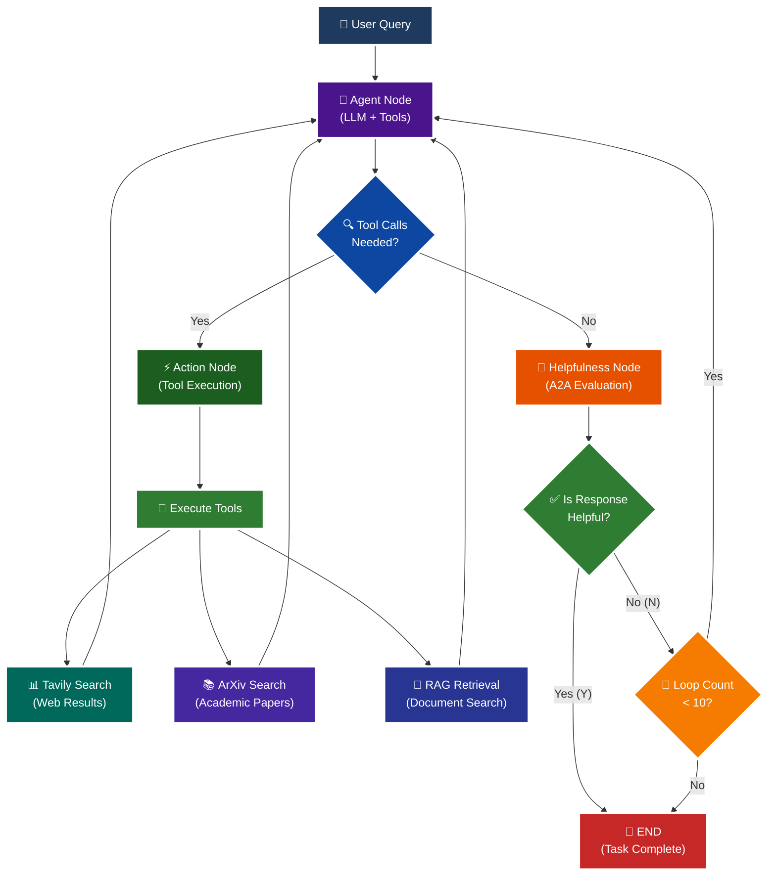

<p align = "center" draggable="false" >
</p>

## <h1 align="center" id="heading">Session 15: Build & Serve an A2A Endpoint for Our LangGraph Agent</h1>

| 📰 Session Sheet                                                                                                                                 | ⏺️ Recording                                                                                                                                 | 🖼️ Slides                                                                                                                                                                          | 👨‍💻 Repo       | 📝 Homework                                                       | 📁 Feedback                                               |
| :----------------------------------------------------------------------------------------------------------------------------------------------- | :------------------------------------------------------------------------------------------------------------------------------------------- | :--------------------------------------------------------------------------------------------------------------------------------------------------------------------------------- | :------------ | :---------------------------------------------------------------- | :-------------------------------------------------------- |
| [Session 15: Agent2Agent Protocol & Agent Ops](https://www.notion.so/Session-15-Agent2Agent-Protocol-Agent-Ops-26acd547af3d807c9fcdcc8864a6608a) | [Recording!](https://us02web.zoom.us/rec/share/Iz9bYK2w3p4FrtspRgMW4JKKxAlBVy1lKA-Xi99MzL7sqiLyHHVyAmyAq203HlqI.FvkopZBYLuYyCCu0) (Lyk+4@LS) | [Session 15 Slides](https://www.canva.com/design/DAG3HTQCrYs/Q2Oil7xFzz4DFEgmXdSGgg/edit?utm_content=DAG3HTQCrYs&utm_campaign=designshare&utm_medium=link2&utm_source=sharebutton) | You are here! | [Session 15 Assignment: A2A](https://forms.gle/fKTXjMJZHLReENUW9) | [AIE8 Feedback 9/16](https://forms.gle/LhGHKygFT3bfLqfS9) |

# A2A Protocol Implementation with LangGraph

This session focuses on implementing the **A2A (Agent-to-Agent) Protocol** using LangGraph, featuring intelligent helpfulness evaluation and multi-turn conversation capabilities.

## 🎯 Learning Objectives

By the end of this session, you'll understand:

- **🔄 A2A Protocol**: How agents communicate and evaluate response quality

## 🧠 A2A Protocol with Helpfulness Loop

The core learning focus is this intelligent evaluation cycle:



# Build 🏗️

Complete the following tasks to understand A2A protocol implementation:

## 🚀 Quick Start

```bash
# Setup and run
./quickstart.sh
```

```bash
# Start LangGraph server
uv run python -m app
```

```bash
# Test the A2A Serer
uv run python app/test_client.py
```

### 🏗️ Activity #1:

Build a LangGraph Graph to "use" your application.

Do this by creating a Simple Agent that can make API calls to the 🤖Agent Node above through the A2A protocol.

### ❓ Question #1:

What are the core components of an `AgentCard`?

##### ✅ Answer:

Based on the implementation in `app/__main__.py`, an `AgentCard` contains the following core components:

1. **Identity & Metadata**:

   - `name`: The agent's name (e.g., "General Purpose Agent")
   - `description`: A clear description of what the agent does
   - `url`: The base URL where the agent is hosted
   - `version`: Version string for the agent (e.g., "1.0.0")
   - `protocolVersion`: The A2A protocol version being used (e.g., "0.3.0")

2. **Communication Configuration**:

   - `preferredTransport`: Transport protocol preference (e.g., "JSONRPC")
   - `defaultInputModes`: List of supported input content types (e.g., ["text", "text/plain"])
   - `defaultOutputModes`: List of supported output content types (e.g., ["text", "text/plain"])

3. **Capabilities**:

   - `capabilities`: Object defining what the agent can do:
     - `streaming`: Boolean indicating if streaming responses are supported
     - `pushNotifications`: Boolean indicating if push notifications are supported

4. **Skills**:
   - `skills`: Array of AgentSkill objects, where each skill defines:
     - `id`: Unique identifier for the skill
     - `name`: Human-readable skill name
     - `description`: What the skill does
     - `tags`: Array of tags for categorization
     - `examples`: Array of example queries that would use this skill

The AgentCard serves as a "business card" for the agent, allowing other agents and clients to discover its capabilities and determine if it can help with their needs.

<br />

### ❓ Question #2:

Why is A2A (and other such protocols) important in your own words?

##### ✅ Answer:

A2A (Agent-to-Agent) protocols are crucial for the future of AI systems for several key reasons:

1. **Interoperability & Composability**: Just like APIs revolutionized web services by allowing different applications to communicate, A2A protocols enable different AI agents to discover and interact with each other seamlessly. This means we can build complex AI systems by composing specialized agents rather than creating monolithic solutions.

2. **Standardization & Discovery**: The AgentCard mechanism provides a standardized way for agents to advertise their capabilities, similar to how OpenAPI/Swagger specs help developers discover and use REST APIs. This standardization makes it easier to build ecosystems of agents that can work together without custom integration for each pair of agents.

3. **Autonomy & Delegation**: A2A protocols enable true agent autonomy by allowing agents to delegate tasks to other specialized agents. For example, a general-purpose assistant can delegate research tasks to a specialized research agent, web search to a search agent, or document analysis to a RAG agent - all through standard protocols.

4. **Quality Assurance & Feedback Loops**: The helpfulness evaluation mechanism in A2A demonstrates how protocols can include quality checks and feedback loops, ensuring that agent interactions meet quality standards before completion. This is critical for production systems.

5. **Scalability of AI Systems**: By establishing common protocols, we can build distributed AI systems where specialized agents can be developed independently, deployed separately, and still work together cohesively. This is essential for scaling AI systems beyond single-vendor solutions.

6. **Future-Proofing**: As AI agents become more prevalent, having standard communication protocols prevents vendor lock-in and enables a marketplace of AI capabilities where agents from different providers can collaborate effectively.

In essence, A2A protocols do for AI agents what HTTP/REST did for web services - they provide the foundational infrastructure for a connected ecosystem of intelligent services that can work together to solve complex problems.

<br /><br />

<details>
<summary>🚧 Advanced Build 🚧 (OPTIONAL - <i>open this section for the requirements</i>)</summary>

Use a different Agent Framework to **test** your application.

Do this by creating a Simple Agent that acts as different personas with different goals and have that Agent use your Agent through A2A.

Example:

"You are an expert in Machine Learning, and you want to learn about what makes Kimi K2 so incredible. You are not satisfied with surface level answers, and you wish to have sources you can read to verify information."

</details>

## 📁 Implementation Details

For detailed technical documentation, file structure, and implementation guides, see:

**➡️ [app/README.md](./app/README.md)**

This contains:

- Complete file structure breakdown
- Technical implementation details
- Tool configuration guides
- Troubleshooting instructions
- Advanced customization options

# Ship 🚢

- Short demo showing running Client

# Share 🚀

- Explain the A2A protocol implementation
- Share 3 lessons learned about agent evaluation
- Discuss 3 lessons not learned (areas for improvement)

# Submitting Your Homework

## Main Homework Assignment

Follow these steps to prepare and submit your homework assignment:

1. Create a branch of your `AIE8` repo to track your changes. Example command: `git checkout -b s15-assignment`
2. Complete the activity above
3. Answer the questions above _in-line in this README.md file_
4. Record a Loom video reviewing the Simple Agent you built for Activity #1 and the results.
5. Commit, and push your changes to your `origin` repository. _NOTE: Do not merge it into your main branch._
6. Make sure to include all of the following on your Homework Submission Form:
   - The GitHub URL to the `15_A2A_LANGGRAPH` folder _on your assignment branch (not main)_
   - The URL to your Loom Video
   - Your Three Lessons Learned/Not Yet Learned
   - The URLs to any social media posts (LinkedIn, X, Discord, etc.) ⬅️ _easy Extra Credit points!_

### OPTIONAL: 🚧 Advanced Build Assignment 🚧

<details>
  <summary>(<i>Open this section for the submission instructions.</i>)</summary>

Follow these steps to prepare and submit your homework assignment:

1. Create a branch of your `AIE8` repo to track your changes. Example command: `git checkout -b s015-assignment`
2. Complete the requirements for the Advanced Build
3. Record a Loom video reviewing the agent you built and demostrating in action
4. Commit, and push your changes to your `origin` repository. _NOTE: Do not merge it into your main branch._
5. Make sure to include all of the following on your Homework Submission Form: + The GitHub URL to the `15_A2A_LANGGRAPH` folder _on your assignment branch (not main)_ + The URL to your Loom Video + Your Three Lessons Learned/Not Yet Learned + The URLs to any social media posts (LinkedIn, X, Discord, etc.) ⬅️ _easy Extra Credit points!_
</details>
